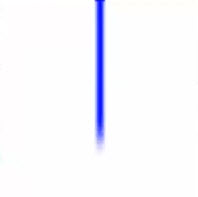
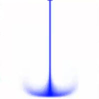
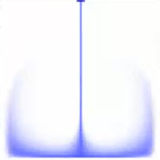

# Fluid Simulator (2D)

Considerable effort is needed to describe the many aspects of fluid motion.
Even more effort is needed for animating fluids in real-time. Being fascinated with fluid dynamics when I was a physics undergraduate and someone with a profound interest in 3D graphics, I was interested to learn how this is done programmatically. Here, I put together a 2D fluid simulator which is based on the classic [Stable Fluids](https://d2f99xq7vri1nk.cloudfront.net/legacy_app_files/pdf/ns.pdf)
algorithm on solving the Navier-Stokes equations for incompressible flow by Jos Stam[[1]](#1).
The graphics framework for this simulator is based on the [LearnOpenGL Breakout tutorial](https://learnopengl.com/In-Practice/2D-Game/Breakout).

## Library
Program was originally developed on Visual Studio v15.9 and uses the following libraries:
* Eigen
* GLFW, GLEW, GLM (OpenGL)
* OpenMP 

## Results

(Left to right): A fluid in a rectangular box flows out from an invisible tube from top to bottom, hits a boundary and circulates around. 

## Next steps?
Perhaps a more modern approach to parallelization is CUDA C - an API that I have been interested in learning. It might be worth trying to see how it compares with OpenMP in terms of performance.

## References
<a id="1">[1]</a>
J. Stam, Stable Fluids, ACM SIGGRAPH 99, 1999.